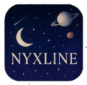

# NyxLine - Astronomi Sosyal Medya Platformu 🌟



NyxLine, astronomi tutkunlarını bir araya getiren ve Türkiye'deki gözlem noktalarını keşfetmelerini sağlayan modern bir sosyal medya platformudur. .NET MAUI ve ASP.NET Core teknolojileri kullanılarak geliştirilmiştir.

## 🚀 Özellikler

### 👥 Kullanıcı Yönetimi
- Kayıt ve giriş sistemi
- Profil yönetimi ve özelleştirme
- Şifre değiştirme ve sıfırlama
- Kullanıcı rolleri (normal kullanıcı, admin)

### 📱 Sosyal Medya İşlevleri
- Gönderi oluşturma ve paylaşma
- Beğeni ve yorum sistemi
- Kullanıcı takip mekanizması
- Gönderi repost özelliği
- Arama ve keşfet fonksiyonları

### 🔭 Gözlem Noktaları
- Türkiye'nin en iyi gözlem noktaları veritabanı
- Konum bazlı yakın nokta önerileri
- Detaylı nokta bilgileri (rakım, ışık kirliliği, ulaşım)
- Ekipman önerileri

### 👨‍💼 Admin Paneli
- Kullanıcı yönetimi
- İçerik moderasyonu
- Sistem istatistikleri

## 🛠️ Teknolojiler

### Backend
- ASP.NET Core 8.0
- Entity Framework Core
- SQL Server
- JWT Authentication
- REST API

### Frontend
- .NET MAUI
- XAML
- Model-View-ViewModel (MVVM)
- Responsive Design

## 📦 Kurulum

### Gereksinimler
- Visual Studio 2022
- .NET 8.0 SDK
- SQL Server (LocalDB veya Express)
- Android SDK (Android geliştirme için)
- Xcode (iOS geliştirme için, sadece macOS)

### Adımlar
1. Repoyu klonlayın:
   ```bash
   git clone https://github.com/yourusername/NyxLine.git
   ```

2. API projesini başlatın:
   ```bash
   cd NyxLine.API
   dotnet run
   ```

3. MAUI projesini Visual Studio'da açın ve çalıştırın.

## 📱 Ekran Görüntüleri

[Ekran görüntüleri buraya eklenecek]

## 🗺️ Yol Haritası

- [ ] Canlı gökyüzü haritası
- [ ] Gözlem etkinlikleri oluşturma
- [ ] Astrofotoğrafçılık rehberleri
- [ ] Teleskop paylaşım platformu
- [ ] Çoklu dil desteği

## 🤝 Katkıda Bulunma

1. Fork edin
2. Feature branch oluşturun (`git checkout -b feature/AmazingFeature`)
3. Değişikliklerinizi commit edin (`git commit -m 'Add some AmazingFeature'`)
4. Branch'inizi push edin (`git push origin feature/AmazingFeature`)
5. Pull Request oluşturun

## 📄 Lisans

Bu proje MIT lisansı altında lisanslanmıştır. Detaylar için [LICENSE](LICENSE) dosyasına bakın.

## 📞 İletişim

[İletişim bilgileri buraya eklenecek]

## 🌟 Teşekkürler

Bu projeye katkıda bulunan herkese teşekkürler! 