# NyxLine - Astronomi Sosyal Medya Platformu 🌟


NyxLine, astronomi tutkunlarını bir araya getiren ve Türkiye'deki gözlem noktalarını keşfetmelerini sağlayan modern bir sosyal medya platformudur. .NET MAUI ve ASP.NET Core teknolojileri kullanılarak geliştirilmiştir.

## 📱 Ekran Görüntüleri

### Giriş ve Hesap İşlemleri
| Giriş | Kayıt | Şifremi Unuttum |
|-------|-------|-----------------|
| 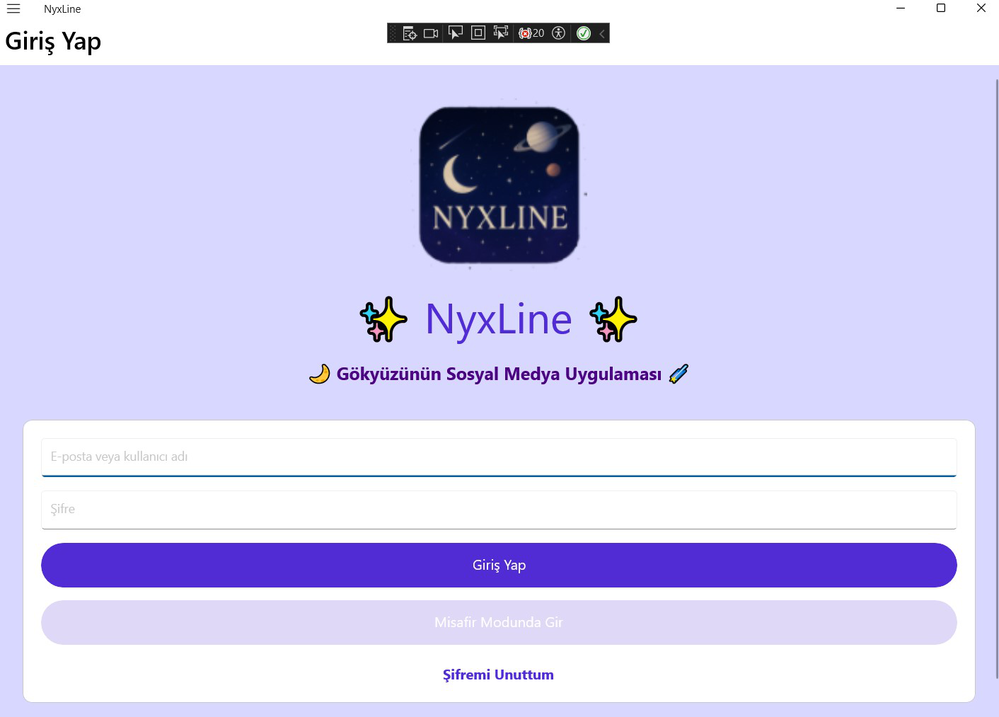 | 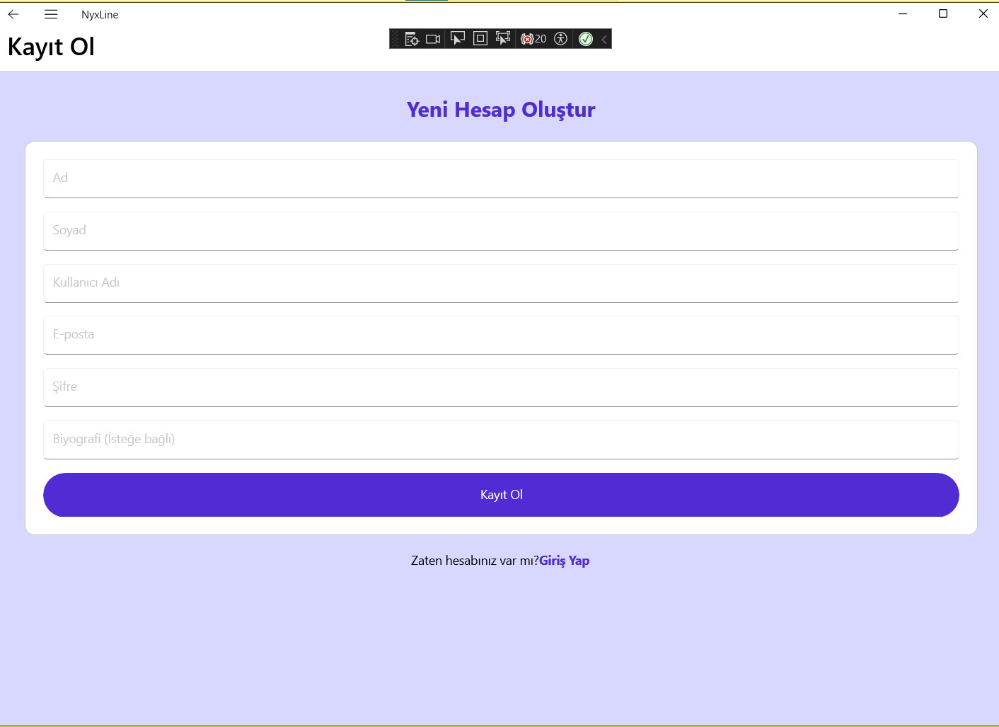 | 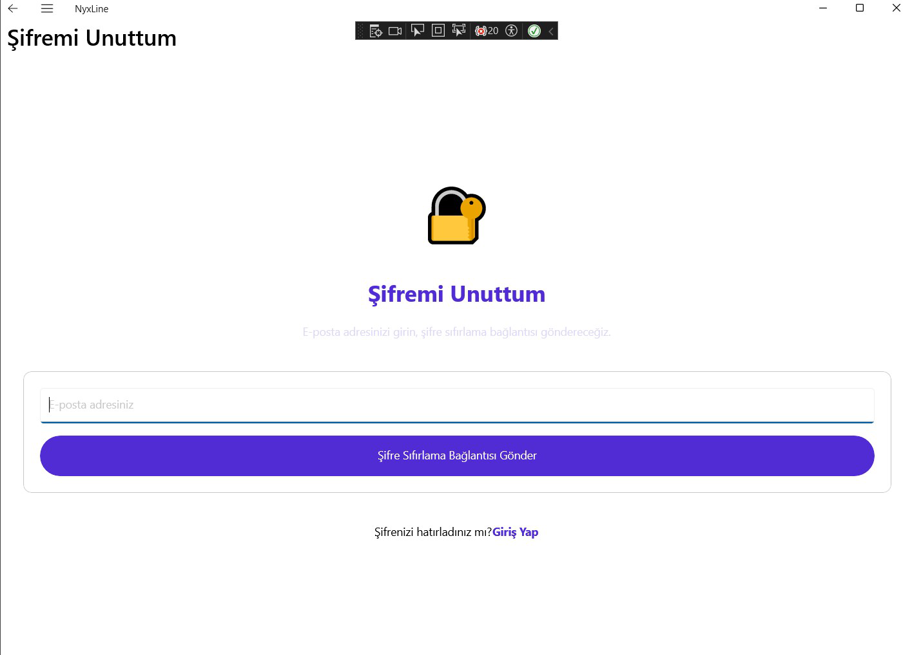 |

### Ana Akış ve Arama
| Ana Sayfa | Gönderi Detay | Arama |
|-----------|---------------|--------|
| 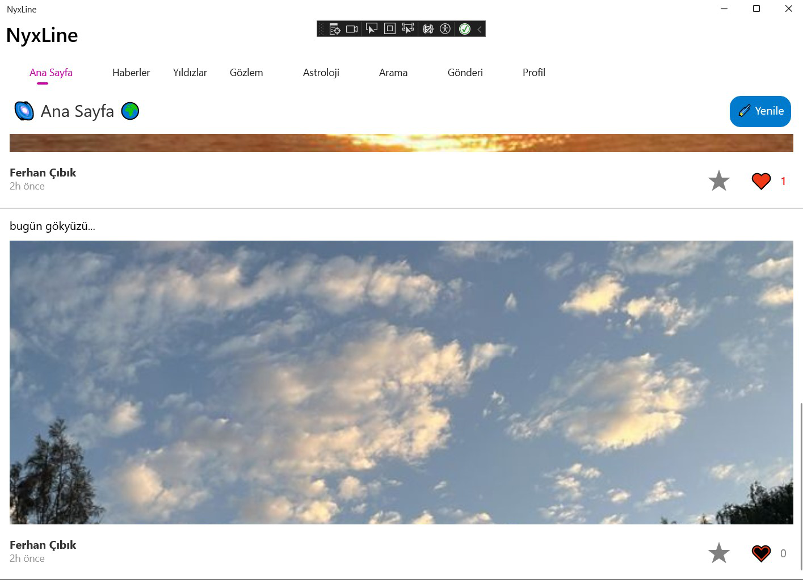 | 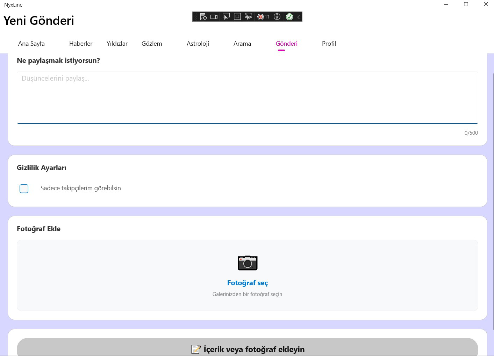 | 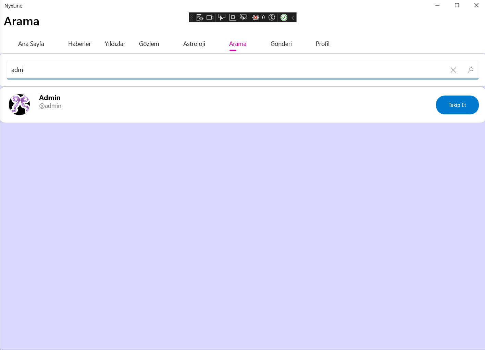 |

### Profil ve Güvenlik
| Profil | Şifre Değiştirme |
|--------|------------------|
| 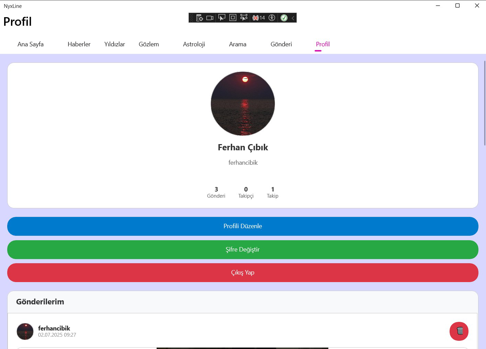 | 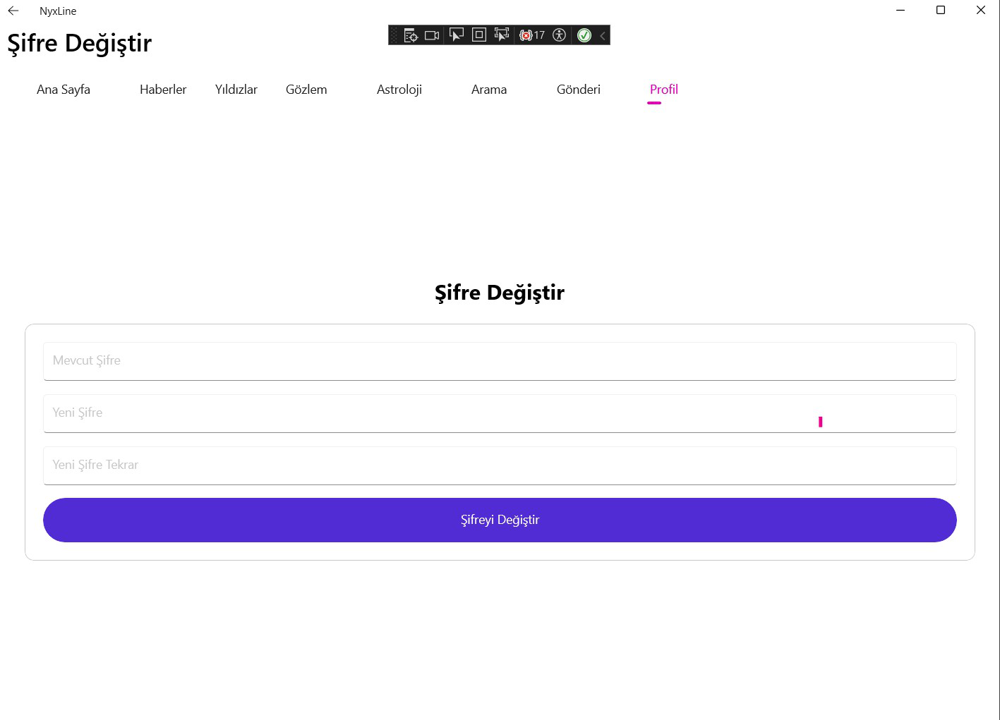 |

### Gözlem Noktaları
| Gözlem Noktaları | Nokta Detay |
|------------------|-------------|
| 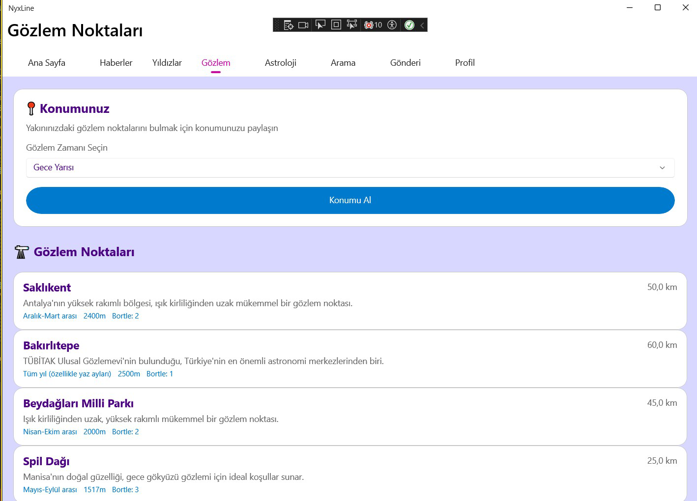 | 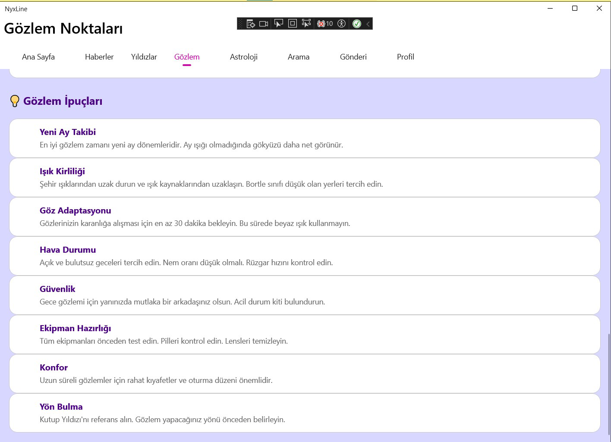 |

### Astronomi
| Yıldızlar | Astroloji |
|-----------|-----------|
| 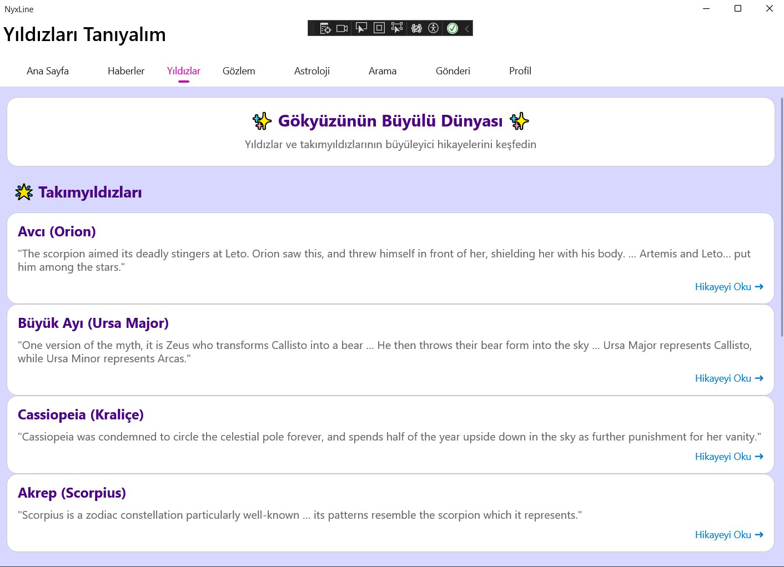 | 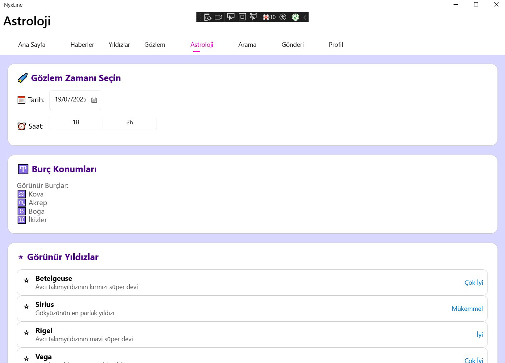 |

## 🚀 Özellikler

### 👥 Kullanıcı Yönetimi
- Kayıt ve giriş sistemi
- Profil yönetimi ve özelleştirme
- Şifre değiştirme ve sıfırlama
- Kullanıcı rolleri (normal kullanıcı, admin)

### 📱 Sosyal Medya İşlevleri
- Gönderi oluşturma ve paylaşma
- Beğeni ve yorum sistemi
- Kullanıcı takip mekanizması
- Gönderi repost özelliği
- Arama ve keşfet fonksiyonları

### 🔭 Gözlem Noktaları
- Türkiye'nin en iyi gözlem noktaları veritabanı
- Konum bazlı yakın nokta önerileri
- Detaylı nokta bilgileri (rakım, ışık kirliliği, ulaşım)
- Ekipman önerileri

### 🌟 Astronomi Özellikleri
- Yıldız kataloğu ve detaylı bilgiler
- Astroloji burç yorumları
- Günlük gök olayları
- Astronomi haberleri

## 🛠️ Teknolojiler

### Backend
- ASP.NET Core 8.0
- Entity Framework Core
- SQL Server
- JWT Authentication
- REST API

### Frontend
- .NET MAUI
- XAML
- Model-View-ViewModel (MVVM)
- Responsive Design

## 📦 Kurulum

### Gereksinimler
- Visual Studio 2022
- .NET 8.0 SDK
- SQL Server (LocalDB veya Express)
- Android SDK (Android geliştirme için)
- Xcode (iOS geliştirme için, sadece macOS)

### Adımlar
1. Repoyu klonlayın:
   ```bash
   git clone https://github.com/ferhancibik/NyxLine.git
   ```

2. API projesini başlatın:
   ```bash
   cd NyxLine.API/NyxLine.API
   dotnet run
   ```

3. MAUI projesini Visual Studio'da açın ve çalıştırın.

## 📄 Lisans

Bu proje MIT lisansı altında lisanslanmıştır. Detaylar için [LICENSE](LICENSE) dosyasına bakın. 